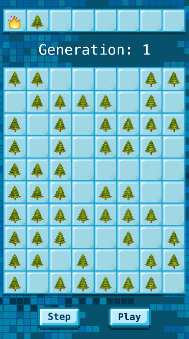
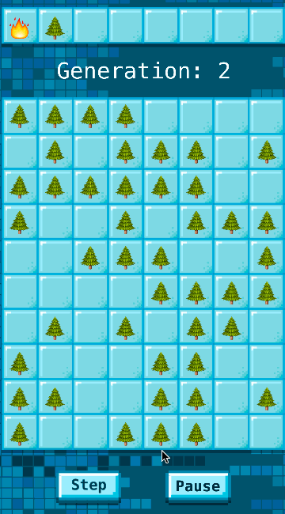

> [info]
> You can open an emoji search popup on any OS X computer by holding `control + command` and press the `space bar`.

Now that we've successfully replicated our Game of Life logic in a separate Xcode project, it's time to make our own custom Simulation, complete with new rules and emojis – one that simulates the spread of forest fires!

> [action]
> Open up [this page](http://ncase.me/simulating/) and read through "A Tiny Forest For Tiny Trees". We'll be implementing this simulation!

Here is a summary of the rules that we're implementing:

- **Setup:**
  1. **Palette setup:** 🌲 and 🔥 should be in the palette.
  1. **Random seeding:** Create a `8x10` grid randomly populated with a `50%` chance of a 🌲 tile, or empty otherwise.
- **Update:**
  1. **Spawning trees:** An empty tile has a `0.1%` chance of becoming a 🌲.
  1. **Burning trees:** 🌲 turns into 🔥 if any of it's neighbors are 🔥.
  1. **Sizzling out:** 🔥 dies out and becomes an empty tile.

We'll be conquering each of this rules one at a time.

## ForestFireSimulation Class

Sounds like fun! To begin, let's make a new file for our new simulation.

> [action]
> Click on the `Models` group in the left sidebar. With it selected, navigate to `File > New File`, or press `command+N`. Create a new Swift file (`iOS > Source > Swift File`) entitled `ForestFireSimulation.swift`, and put it inside the folder `Grid-Simulations-Xcode/Grid-Simulations`. Watch this video to see how to do it!
> 

Great! Now let's make a new class for our `ForestFireSimulation`, inherited from `Simulation`.

> [action]
> In `ForestFireSimulation.swift`, insert the following code:
>
```swift
public class ForestFireSimulation: Simulation {
    public override func setup() {
>
    }
>
    public override func update() {
>
    }
}
```

# Scene Setup

In the Game of Life, we set the initial state through a text-based loader that automatically read the grid from a `.txt` file. In our new simulation we won't have a use for this since our start grid state will be randomly generated. We will be including our initialization code in the `setup()` function of our `ForestFireSimulation` class.

First, let's remove the code that loads the grid state from file and replace it with our own logic:

<!-- ACTION: UPDATE THESE INSTRUCTIONS AFTER ADDING SIMULATION CHOOSE SCREEN -->

> [action]
> Open `GameViewController.swift`. Remember, this is where the loading of our scene happens!
>
> Comment out lines 24 through 26 and uncomment lines 36 & 37. This will load in your `ForestFireSimulation` class with the correct palette!

# (Pseudo) Random number generation

Before we go back to the `setup()` function in `ForestFireSimulation.swift` let's talk about random numbers

Computers generally utilize an algorithm called [Pseudorandom Number Generator](https://en.wikipedia.org/wiki/Pseudorandom_number_generator) in order to generate sufficiently random numbers. Swift provides several ways to do this, and here is one:

```swift
arc4random()
```

This will return a `Int` between values 0 and `RAND_MAX` – a global constant you can use in your code. So what if you instead want a `Double`, between the range 0 and 1?

```swift
Double(arc4random()) / Double(UInt32.max)
```

Since you'll be using this often, we've created a function called `randomZeroToOne()` that returns a `Double` between zero and one. You can use it anywhere in this app!

> [info]
> You have to cast both values to `Double`, since Swift will not implicitly convert `Int`s to `Double`s through mathematical operations. This point differentiates Swift from other languages like Java.

<!-- ## Seeding your random numbers

However, because the pseudorandom algorithm is _deterministic_, it will give you the same results each time you run your app. That's not what we want!

Pseudorandom number generators often have something called a "seed" value – a single truly random number that all subsequent `random()` calls are based off. But what is a truly random seed that we can use? Let's try the current time:

```swift
let time = UInt32(NSDate().timeIntervalSinceReferenceDate)
srandom(time) // this "seeds" subsequent random() calls
```

So, you call the `srandom()` function once in your app, before you generate any `random()` numbers – and then your random numbers will be different each time you open your app! Let's go ahead and write this `srandom()` code somewhere that runs only once – the `viewDidLoad()` function in `GameViewController`:

> [action]
> In line 17 of `GameViewController` – right after the call to `super.viewDidLoad()` – add in the above code to "seed" the random number generator, using `srandom` and the current time. -->

Let's move on and apply this logic to our `setup()` function.

# Randomly seeding the grid

Our guidelines mentioned that we were to create a 8x10 grid, randomly filled with a 50% chance of 🌲. So, let's start by creating a 2D array!

From inside the `ForestFireSimulation` class, our grid variable can be accessed via `grid`. So, let's set `grid` to be a new 2D array:

> [action]
> Insert the following into the `setup()` function in `ForestFireSimulation.swift`:
>
```swift
grid = [[Character?]](repeating: [Character?](repeating: nil, count: 10), count: 10)
```

Now let's iterate through each tile in our 2D grid, and set a tile to 🌲 based on a 50% chance. But how do we do that?

Remember how we said you have access to a `randomZeroToOne()` function that returned a value between 0 and 1? If we compare that number against `0.5`, we'll have a 50% chance of succeeding!

> [action]
> Go ahead and write the code to populate the tiles with 🌲. Do you remember how to iterate through elements of an array? Iterate through them and on each, change the value to 🌲 if `randomZeroToOne()` returns a value less than `0.5`.

<!--  -->

> [solution]
> Done? Your `setup()` function should look something like this:
>
```swift
grid = [[Character?]](repeating: [Character?](repeating: nil, count: 10), count: 10)
for x in 0..<8 {
    for y in 0..<10 {
        if randomZeroToOne() < 0.5 {
            grid[x][y] = "🌲"
        }
    }
}
```

If you run your code, you should now see random 🌲 filling the tiles!

<!-- Great! Now we spawn our random 🔥 at a random tile location. Here, we learn about the modulo `%` operator:

```swift
10 % 3
```

The modulo operator, or `%`, will return the remainder of an integer division. So in this example, the above code will return a `1`.

Why is this useful? Well, say you wanted a random number between 0 and 9 – just perfect for the index position of our grid:

```swift
arc4random() % 10
```

Since `random()` returns an `Int`, we can modulo it against 10 to return a value between 0 (inclusive) and 10 (exclusive). Now all we have to do is call this twice to get our random x and y coordinates, and set the corresponding tile to 🔥!

Let's see if you can write this code – place it at the end of the `setup()` function – right after the code you just wrote.

> [solution]
> Your code should look something like this:
>
```swift
let x = arc4random() % 10
let y = arc4random() % 10
grid[x][y] = "🔥"
```

Run your code again. You should now see a single 🔥 placed at a random location! -->

# Retrieving neighbors

Before we dive into the update loop, we should write some helper functions that will retrieve the neighbors of each position in the grid.

## isLegalPosition

First, let's make a helper function, that determines if a grid position is in bounds of the grid, and returns a `Bool`. Let's call this function `isLegalPosition(x: Int, y: Int)`.

> [action]
> Create a new function, right below the empty `update()` function block. It should look like this:
>
```swift
func isLegalPosition(x: Int, y: Int) -> Bool {
>
}
```
> Now, insert code that returns true if the given x and y coordinates are inside the `grid` bounds, and false otherwise.

<!--  -->

> [solution]
> Your `isLegalPosition` function should look like this:
>
```swift
func isLegalPosition(x: Int, y: Int) -> Bool {
    if x >= 0 && x < grid.count && y >= 0 && y < grid[0].count {
        return true
    } else {
        return false
    }
}
```

## getNeighborPositions

Next, we'll write a function to return the positions of a cell's neighbors -- `getNeighborPositions(x originX: Int, y originY: Int) -> [(x: Int, y: Int)]`. It should return an `Array` of `(Int, Int)` tuples representing the `(x, y)` location of each neighbor within the bounds of the grid.

### Wait, wait, wait. What is a `tuple`?

What's this return type, you ask? The parentheses syntax represents Swift's _tuple_ type, which you can read about [here](https://developer.apple.com/library/ios/documentation/Swift/Conceptual/Swift_Programming_Language/TheBasics.html#//apple_ref/doc/uid/TP40014097-CH5-ID329). Basically, it's a way for you to quickly house multiple variables of potentially different types in one container. It's pretty much a lightweight class! So in this example, our function returns an _array_ of _tuples_ – containing two `Int`s, for the `x` and `y` indices.

Tuples can be instantiated like this:

```swift
let tuple = (2, 3)
```

...and if the tuple is a _named_ tuple, as is the case in our return statement, you can access the individual elements like this:

```swift
let namedTuple = (x: 2, y: 3)
let x = namedTuple.x
let y = namedTuple.y
```

> [action]
> Create a new function, right below the `isLegalPosition` function. It should look like this:
>
```swift
func getNeighborPositions(x originX: Int, y originY: Int) -> [(x: Int, y: Int)] {
>
}
```
> Now, insert code that returns an `Array` of `(Int, Int)` tuples representing the `(x, y)` location of each neighbor within the bounds of the grid.
>
> How do you know if a grid position is legal? Call the function you just wrote – `isLegalPosition()`! Remember, you can use the `for x in a...b` syntax to traverse from values `a` and `b` (inclusively). You can append to a `(Int, Int)` tuple to an `Array` by calling `myArray.append((xValue, yValue))`.
>
> Before you get started, ask yourself: what ranges do you need to loop over? How will you make sure not to add `(originX, originY)` to the returned `Array`?

<!--  -->

>[solution]
> Your `getNeighborPositions` function should look like this:
>
```swift
func getNeighborPositions(x originX: Int, y originY: Int) -> [(x: Int, y: Int)] {
    var neighbors: [(x: Int, y: Int)] = []
    for x in (originX - 1)...(originX + 1) {
        for y in (originY - 1)...(originY + 1) {
            if isLegalPosition(x: x, y: y) {
                if !(x == originX && y == originY) {
                    neighbors.append((x, y))
                }
            }
        }
    }
    return neighbors
}
```

# Spawning trees

Great! Now that we have a few helper functions, we can get started with growing our forest by spawning new trees. If you take a look at the rules again, then you'll notice that an empty tile has a `0.1%` chance of becoming a 🌲.

Since these rules (like Conway's Game of Life) will require a temporary grid to hold the new state of the simulation. Let's get started by adding an instance variable to hold this temporary grid!

> [action]
> Create a `newGrid: [[Character?]]` instance variable in the `ForestFireSimulation` class.
>
> Add this line above and outside of your `setup()` function:
>
```
var newGrid: [[Character?]] = []
```
>
Now, at the start of your `update()` method, set the `newGrid` equal to `grid`. Then create loops to iterate over each element in `grid` (see Game of Life if you need a hint). At the end of the function (after the loops), set `grid` equal to `newGrid` so that the state will update!
>
Inside of those loops, you should check if a tile is empty (remember, empty tiles are equal to `nil`). If it is empty, grab a value from `randomZeroToOne()` and spawn a tree with a `0.1%` chance.

Remember, `1%` translates to a value of `0.01`! Make sure you are spawning trees at the correct rate. It's also extremely important to remember that you should be reading values from `grid` and setting values to `newGrid`!

>[solution]
> Your `update` function should currently look like this:
>
```
public override func update() {
    newGrid = grid
>    
    for x in 0..<grid.count {
        for y in 0..<grid[x].count {
            let tile = grid[x][y]
            if tile == nil {
                if randomZeroToOne() < 0.001 {
                    newGrid[x][y] = "🌲"
                }
            }
        }
    }
>    
    grid = newGrid
}
```



Run your code and tap the Play button! Spend some time watching the trees grow... It might take a little while before you see one popup (`0.1%` is small) but it's still pretty peaceful.

# Burning trees and spreading fire

Now that we've just centered ourself with the zen of create, it's time to write the code for fire propagation. The rule for 🔥 is a 🌲 turns into 🔥 if any of it's neighbors are 🔥. We already have all the loops and helper functions that we'll need so let's jump right in!

> [action]
> Can you modify the code for this new rule without any hints? Get started now if you think you can!
>
> If you need a hint... Add another check inside the loops to see if the current tile is a 🌲. If it is, call `getNeighborPositions`. Iterate over those values in `grid` and check for 🔥 tiles. If you find one, set the 🌲 tile in `newGrid` to 🔥!
>
> Remember, you can access the `x` and `y` values of a tuple returned by `getNeighborPositions` with `.x` and `.y` on any of the elements in the `Array`.

<!--  -->

> [solution]
> Your `update` function should currently look like this:
>
```
public override func update() {
    newGrid = grid
>
    for x in 0..<grid.count {
        for y in 0..<grid[x].count {
            let tile = grid[x][y]
            if tile == nil {
                if randomZeroToOne() < 0.001 {
                    newGrid[x][y] = "🌲"
                }
            } else if tile == "🌲" {
                let neighborCords = getNeighborPositions(x: x, y: y)
                for neighborCoord in neighborCords {
                    let neighbor = grid[neighborCoord.x][neighborCoord.y]
                    if neighbor == "🔥" {
                        newGrid[x][y] = "🔥"
                    }
                }
            }
        }
    }
>
    grid = newGrid
}
```


Ready for some destruction to balance out the creation from the last step? Run your code and tap the Play button. When you're ready to go, select 🔥 from the palette and tap a tile, and sit back while the forest gets engulfed in fire. Pretty scary, huh?

> [action]
> Pay close attention to how your fire spreads. If it is not spreading to every neighboring 🌲 (diagonals included) then you should go back and debug your `getNeighborPositions` helper function!

# Sizzling out

The fire is currently taking over the forest and never dies out! We need to implement the last rule of 🔥 dies out and becomes an empty tile. This one is pretty straightforward -- no random chance or neighbors involved!

> [action]
> Implement the last rule in your simulation so the fire dies out each generation.
>
> Add a third check on the tiles as you loop over `grid`. If it is a 🔥, update that tile in `newGrid` to be nil.

<!--  -->

> [solution]
> Your `update` function should currently look like this:
>
```
public override func update() {
    newGrid = grid
>
    for x in 0..<grid.count {
        for y in 0..<grid[x].count {
            let tile = grid[x][y]
            if tile == nil {
                if randomZeroToOne() < 0.001 {
                    newGrid[x][y] = "🌲"
                }
            } else if tile == "🌲" {
                let neighborCords = getNeighborPositions(x: x, y: y)
                for neighborCoord in neighborCords {
                    let neighbor = grid[neighborCoord.x][neighborCoord.y]
                    if neighbor == "🔥" {
                        newGrid[x][y] = "🔥"
                    }
                }
            } else if tile == "🔥" {
                newGrid[x][y] = nil
            }
        }
    }
>
    grid = newGrid
}
```

Run your code and tap the Play button. When you're ready to go, select 🔥 from the palette and tap a tile, and sit back while the forest gets engulfed in fire. This time, the 🔥 should roll through the forest and die out after a generation.



# Checking your results

> [action]
> Open up [this page](http://ncase.me/simulating/) again and compare your simulation to "A Tiny Forest For Tiny Trees". Do your results match theirs?

Congrats! You've made yourself a working simulation of a forest fire in action. On the next page, we'll continue to add more and more realism to the simulation!
